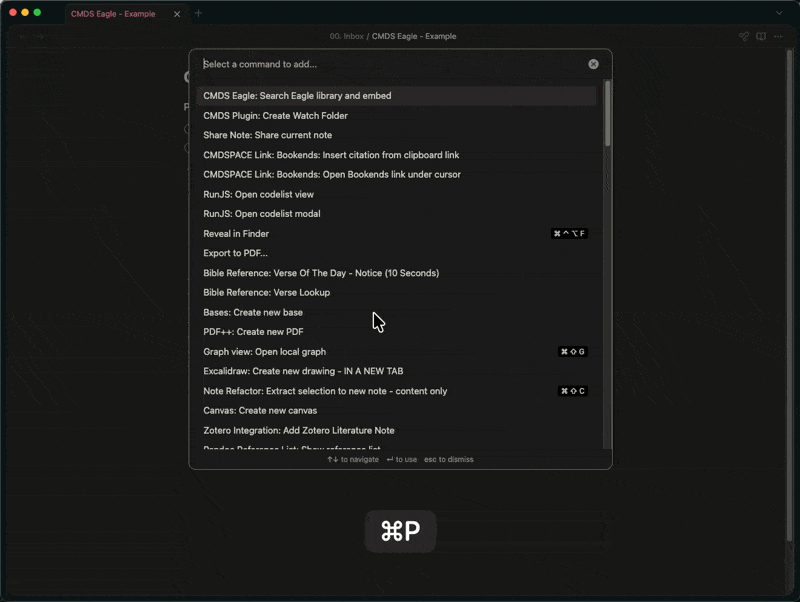
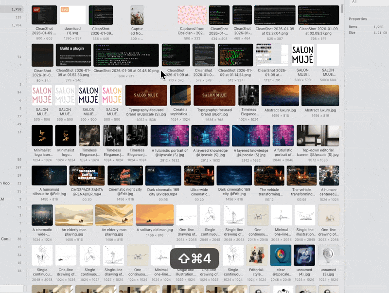
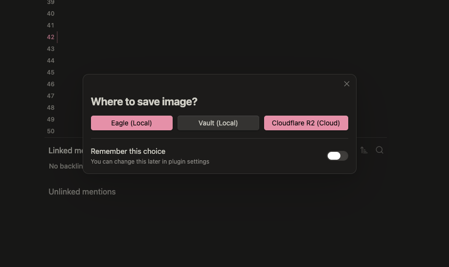
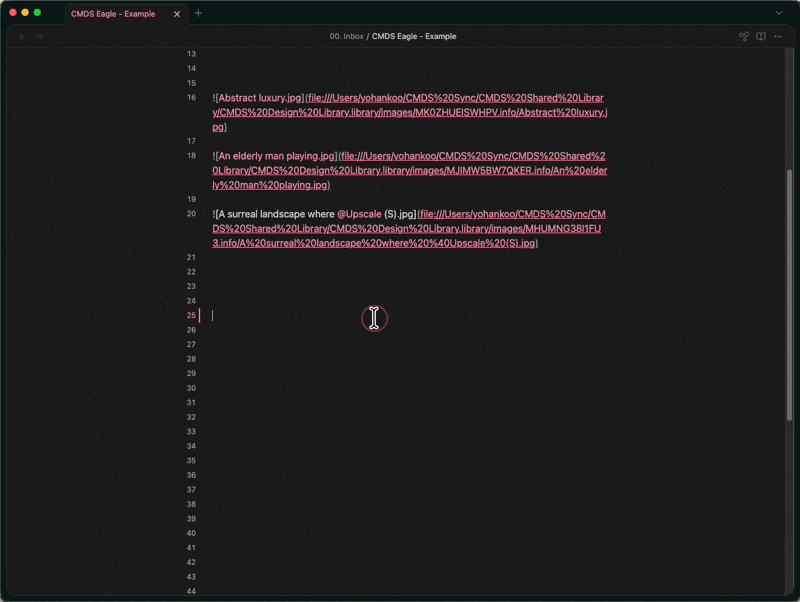
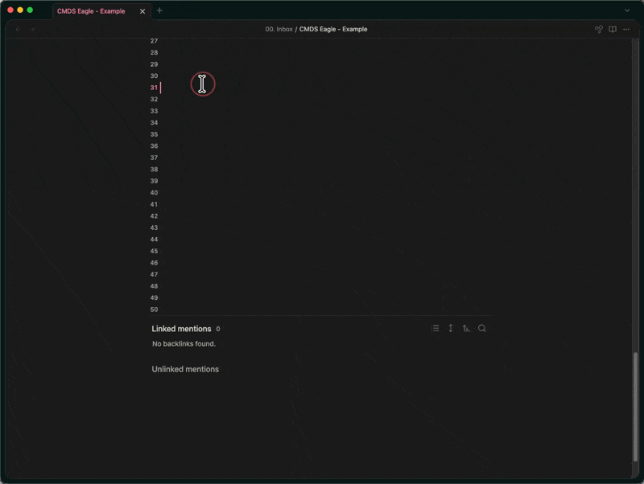
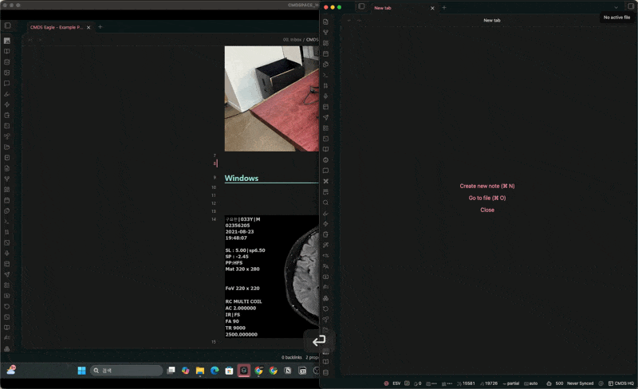
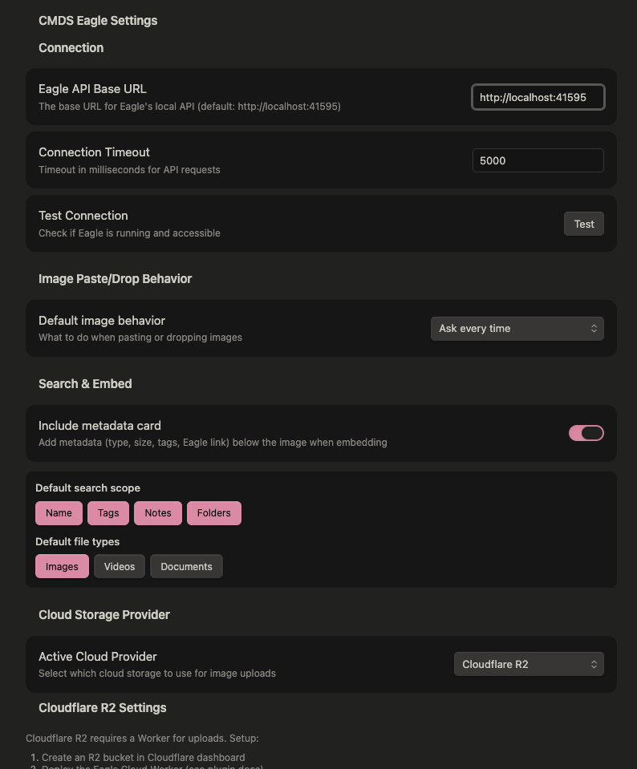
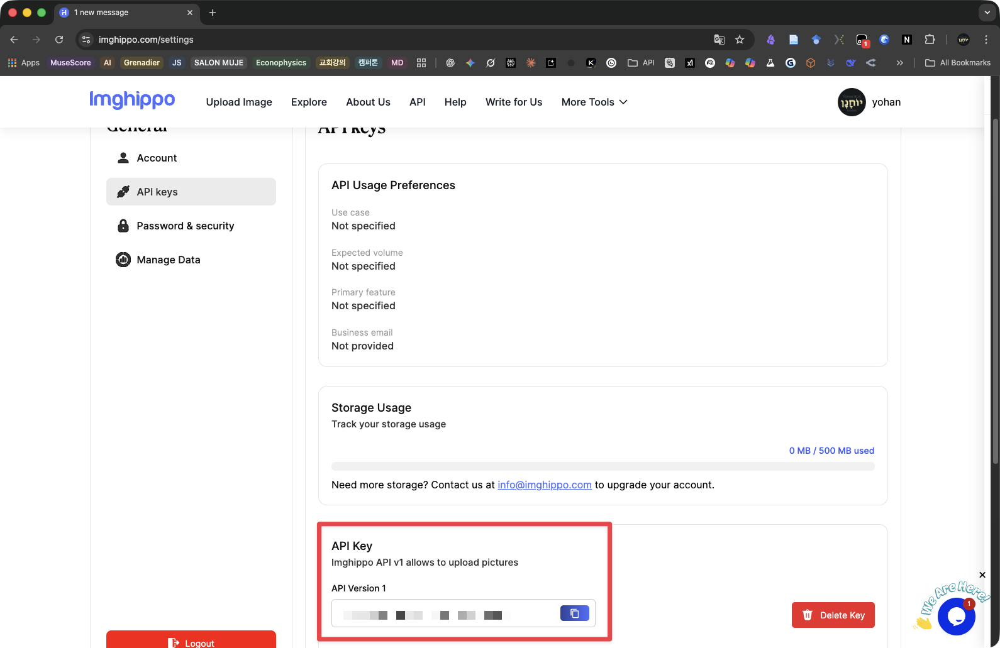

[🇬🇧 English](README.md) · [🇰🇷 한국어](README.ko.md)

# CMDS Eagle

[Eagle](https://eagle.cool) 에셋 라이브러리를 볼트와 연결하는 Obsidian 플러그인입니다.

## 1.8.4의 변경 사항

**이름을 바꾸거나 지운 라이브러리가 목록에 영원히 남았습니다.** 감지는 프로필을 추가하기만 했기 때문에,
Eagle에서 이름을 바꾼 라이브러리는 존재하지 않는 경로를 가리키는 예전 항목으로 설정에 남았고 지울 방법도
없었습니다. 이제 모든 라이브러리 줄에 제거 버튼이 있고, Eagle이 더 이상 알지 못하면서 디스크에서도 사라진
라이브러리는 `Missing`으로 표시되며 목록 위에 `Remove all missing` 버튼이 나타납니다.

프로필에는 저장해둔 기본 폴더가 들어 있으므로 삭제는 기본적으로 사용자가 직접 하도록 두었습니다. 두 신호가
**모두** 일치할 때만 missing으로 판정합니다. Eagle이 목록에서 뺐고 *동시에* 디스크에서도 사라진 경우입니다.
마운트만 해제된 외장·네트워크 볼륨은 Eagle이 계속 기억하므로 목록에 남고 설정도 유지됩니다. Eagle이 실행
중이 아니면 아무것도 판정하지 않습니다. `Scan Eagle`이 알아서 정리하기를 원하면
`Remove missing libraries on scan`을 켜면 됩니다.

## 1.8.2의 변경 사항

**검색이 라이브러리의 일부만 보고 있었습니다.** Eagle은 limit을 주지 않으면 200개만 반환하는데, 검색
창이 limit을 넘기지 않았습니다. 항목이 2,400개인 라이브러리에서는 8%만 대상으로 퍼지 매칭한 셈이고,
나머지는 존재하지 않는 것처럼 동작했습니다. 이제 `Items to pre-load for search`(기본값 5000)만큼 미리
불러오고, 그 상한을 넘으면 입력에 맞춰 Eagle의 keyword 검색 결과를 합칩니다. 라이브러리 크기와 무관하게
모든 항목에 도달할 수 있습니다.

**검색 필터가 아예 그려지지 않았습니다.** 검색 범위 필터(`Name` / `Tags` / `Notes` / `Folders`), 파일
유형 필터, 라이브러리 항목 수 헤더가 모두 빠져 있었습니다. 이를 삽입하는 코드가 잘못된 요소를 찾고
있었기 때문입니다. 이제 정상적으로 표시됩니다.

**볼트 루트에서 첨부 파일 경로가 깨지지 않습니다.** Obsidian의 *Default location for new attachments*를
`Vault folder`로 둔 상태에서 이미지를 로컬에 저장하면 `//파일명.png` 경로가 만들어져 Obsidian이 해석하지
못했습니다. [@nancyel](https://github.com/nancyel) 님이 [#1](https://github.com/johnfkoo951/cmds-eagle/pull/1)
에서 보고하고 수정해 주었고, 인접한 경우까지 확장해 반영했습니다.

## 1.8.0의 새로운 기능

### 여러 Eagle 라이브러리

Eagle은 한 번에 하나의 라이브러리만 엽니다. 다른 라이브러리로 가져오려면 해당 라이브러리로
전환한 뒤 돌아와야 하며, 각 전환에는 약 1초가 걸립니다. **Settings → Eagle libraries**에서 설정합니다.

| Target library | 동작 |
|---|---|
| Currently open library (기본값) | 전환하지 않습니다. 1.7.x와 동일하게 동작합니다. |
| Always a specific library | 필요할 때 지정한 라이브러리로 전환하고, `Switch back after import`가 켜져 있으면 돌아옵니다. |
| Ask every time | 가져올 때마다 선택하므로 한 노트에 여러 라이브러리의 에셋을 담을 수 있습니다. |

가져오는 도중 Eagle에서 직접 다른 라이브러리로 전환하면 사용자의 선택을 우선합니다.
플러그인이 복귀 전에 현재 라이브러리를 확인하므로 사용자가 선택한 상태를 유지합니다.

### 라이브러리별 폴더

라이브러리 루트 대신 폴더로 가져올 수 있습니다. 폴더 ID는 해당 라이브러리에 속하므로
라이브러리마다 기본 폴더를 따로 저장합니다. **Target folder**를 *Ask every time*으로 설정하면
전체 폴더 경로를 검색하는 선택 창이 열립니다. 예를 들어 `proj/jazz`로 `Projects/Jazz Blend`를
찾을 수 있으며, `Inbox/2026`을 입력하면 `Inbox` 아래에 `2026` 폴더를 바로 만들 수 있습니다.

Eagle은 가져올 때만 폴더를 지정합니다. API로 기존 항목을 다른 폴더로 이동할 수 없으므로
대상 폴더를 먼저 선택하며, 다시 분류하려면 재가져오기가 필요합니다.

### 저장 방식과 링크 모드

이전에는 Eagle로 붙여넣어도 볼트에 사본이 남았고, 삽입한 참조가 재동기화나 다른 컴퓨터로의
이동 후에는 유지되지 않았습니다. 이번 버전에서는 다음 세 가지가 바뀌었습니다.

| 항목 | 이전 | 현재 |
|---|---|---|
| `.eagle-temp/`의 임시 사본 | 붙여넣을 때마다 기록하고 삭제하지 않아 Eagle과 볼트 양쪽에 원본이 남았습니다. | Eagle에서 가져오기를 확인하면 삭제합니다. |
| 삽입 경로 | 대안 없이 Eagle 라이브러리의 절대 `file://` 경로를 사용했습니다. | 기본값은 여전히 `cmds-eagle`이지만, `photo-info`는 볼트 상대 경로 썸네일과 `eagle://` 딥 링크를 사용하므로 재동기화 후에도 유지되고 다른 기기에서도 표시됩니다. |
| 썸네일 대기 | 고정된 `delay(1000)`을 사용했으며, 큰 파일은 임시 파일 링크로 대체되어 나중에 연결이 끊겼습니다. | 대기 간격을 지수적으로 늘리며 확인하고, 실패하면 딥 링크를 사용합니다. 컴퓨터에 종속된 경로로 대체하지 않습니다. |

기존 설치의 동작은 유지됩니다. `linkMode` 기본값은 `cmds-eagle`이므로 다른 모드를 선택하기
전까지는 바뀌지 않습니다.

> **Eagle에서 삭제하면 노트에서도 이미지가 사라집니다.** Eagle을 원본 저장소로 사용하는
> `cmds-eagle` 계열 모드의 의도된 동작입니다. 다만 Obsidian이 창을 다시 불러올 때까지
> 메모리에서 이미지를 제공하므로 삭제 직후에도 잠시 표시될 수 있습니다.
> 실제 상태는 `Verify Eagle references in current note`로 확인합니다.
> Eagle에서 삭제한 뒤에도 노트에 이미지를 남기려면 `photo-info`를 선택합니다.

### 링크 모드

**파일 저장 위치**(Eagle / 볼트 / 클라우드 / 매번 선택)와 **노트에 삽입할 형식**은 서로 독립적인
설정입니다. 두 번째 설정이 `linkMode`입니다.

| 모드 | 노트에 삽입되는 내용 | 볼트 사본 | 다른 기기 |
|---|---|---|---|
| **`photo-info`** | 썸네일 + 한 줄 카드 | 썸네일 1개 | ✅ |
| `photo-only` | 썸네일 | 썸네일 1개 | ✅ |
| `link-only` | `eagle://` 링크 | 없음 | ✅ |
| **`cmds-eagle`** (기본값) | 절대 `file://` 임베드 + 카드 | 없음 | 등록한 데스크톱만 지원 |
| `cmds-eagle-photo-only` | 절대 `file://` 임베드 | 없음 | 등록한 데스크톱만 지원 |
| `cmds-eagle-photo-link` | `eagle://` 항목 링크가 연결된 원본 이미지 | 없음 | 등록한 데스크톱만 지원 |

```markdown
# photo-info
[](eagle://item/KXYZ01)
> `png` · 4.2 MB · 1920×1080 · #ui #ref · [Open in Eagle](eagle://item/KXYZ01)

# photo-only
[](eagle://item/KXYZ01)

# link-only
[hero shot](eagle://item/KXYZ01)

```

`cmds-eagle*` 세 모드는 볼트 썸네일 대신 원본 이미지를 사용하며, 출력 구성은 표와 같습니다.
예시에는 컴퓨터별 파일 위치를 넣지 않았습니다.

썸네일은 Eagle 항목 ID를 기준으로 저장하므로 이름을 바꾸거나 다시 삽입해도 중복 생성되지
않습니다. 이미지 경로는 노트 기준 상대 경로이므로 볼트 전체를 동기화할 수 있으며, 카드는
정확히 한 줄입니다. `cmds-eagle*` 모드는 원본 자체를 임베드하므로 라이브러리가 마운트되어
있어야 합니다. 여러 데스크톱에서 같은 라이브러리를 사용하는 방법은
[크로스 플랫폼 동기화](#크로스-플랫폼-동기화)를 참조합니다.
이식 가능한 사진 모드는 썸네일을 얻지 못하면 일반 `eagle://` 링크로 대체합니다.
원본 모드도 원본을 찾지 못하면 같은 방식으로 대체하며, 임시 파일 참조는 사용하지 않습니다.
`cmds-eagle-photo-link`에서는 표시된 원본을 클릭하면 Eagle의 해당 항목이 열립니다.

`photo-*` 출력 형식은 계약 테스트로 검증합니다. `src/canonical.ts`와
`tests/canonical.test.ts`를 참조하며, 표시 형식을 변경할 때 두 파일도 일치시켜야 합니다.

### 기존 볼트의 이미지 이전

`Move all local images in the vault into Eagle`은 참조된 이미지를 가져오고, 모든 참조를
표준 형식으로 바꾼 뒤 볼트 사본을 휴지통으로 보냅니다.
`Move this note's local images into Eagle`은 한 노트에서 대상 이미지를 선택하므로 먼저
시험하기에 적합합니다. 다른 노트에 있는 동일 이미지의 참조도 함께 바뀝니다.
두 명령 모두 확인을 요청하고 처리 결과를 알립니다. 볼트 전체 이전은 원본을 제거하는 작업이며
큰 볼트에서는 오래 걸릴 수 있으므로 먼저 백업합니다. 시스템 휴지통으로 보내려면 Obsidian에서
해당 옵션을 선택합니다. 플러그인은 Obsidian의 삭제 설정을 따릅니다.

## 주요 기능

- **검색 및 임베드**: Eagle 라이브러리를 검색하여 노트에 이미지를 바로 삽입합니다.
- **여러 라이브러리**: 등록된 Eagle 라이브러리를 고정 대상으로 사용하거나 가져올 때마다 선택합니다.
- **폴더 지정**: 라이브러리별 기본 폴더로 가져오거나 매번 폴더를 선택·생성합니다.
- **클라우드 업로드**: ImgHippo, Cloudflare R2, Amazon S3, WebDAV로 이미지를 업로드합니다.
- **붙여넣기·드롭 연동**: 붙여넣거나 드롭한 이미지를 자동으로 처리합니다.
- **일괄 변환**: 노트의 로컬 이미지를 클라우드 URL로 변환합니다.
- **크로스 플랫폼 동기화**: Mac과 Windows 사이의 이미지 경로를 자동 변환합니다.
- **Excalidraw 연동**: 캔버스에 이미지를 붙여넣거나 드롭합니다. Eagle 에셋은 원본을 사용하며, 클립보드 스크린샷은 볼트 첨부파일을 늘리는 대신 클라우드 제공업체로 업로드하고 선택적으로 Eagle에도 추가합니다.

## 설치

### Community plugins에서 설치 (권장)

1. Obsidian에서 **Settings → Community plugins**를 엽니다.
2. **Browse**를 누르고 **CMDS Eagle**을 검색합니다.
3. **Install**을 누른 뒤 **Enable**을 누릅니다.

### 수동 설치

1. [Releases](https://github.com/johnfkoo951/cmds-eagle/releases)에서 `main.js`, `manifest.json`, `styles.css`를 다운로드합니다.
2. 볼트에 `.obsidian/plugins/cmds-eagle/` 폴더를 만듭니다.
3. 다운로드한 파일을 해당 폴더에 복사합니다.
4. Obsidian 설정에서 플러그인을 활성화합니다.

### 개발 빌드

```bash
npm install --legacy-peer-deps   # upstream이 고정한 typescript 4.7.4를 typescript-eslint가 허용하지 않으므로 필요합니다.
npm run build
npm test                          # 표준 출력 형식 계약 테스트입니다.
```

빌드한 `main.js`, `manifest.json`, `styles.css`를 `<vault>/.obsidian/plugins/cmds-eagle/`에
복사한 뒤 Obsidian 설정에서 플러그인을 활성화합니다.

## 요구 사항

- 로컬에서 실행 중인 [Eagle](https://eagle.cool) 앱
- Obsidian 1.6.6 이상

## 사용법

### 검색 및 임베드

Eagle 라이브러리를 검색하여 노트에 이미지를 바로 삽입합니다.



### 이미지 붙여넣기·드롭

이미지를 붙여넣거나 드롭할 때 저장 위치를 선택합니다.




### 클라우드 업로드

공유하거나 다른 기기에서 사용하기 쉽도록 이미지를 클라우드 저장소에 업로드합니다.




### 크로스 플랫폼 동기화

절대 경로로 원본을 임베드하는 `cmds-eagle*` 모드에만 해당합니다. 각 컴퓨터에서 라이브러리를
마운트한 절대 경로를 등록하면 노트를 읽는 컴퓨터에 맞게 경로를 변환합니다.



**동작 방식:**
1. 각 컴퓨터에서 **Add current computer**를 선택합니다. 플러그인이 실행 중인 운영체제와
   로그인 사용자 이름으로 로컬 프로필을 식별하므로, 동기화된 Windows 선택값을 macOS의 현재 프로필로 사용하지 않습니다.
2. 해당 컴퓨터의 라이브러리 루트를 절대 경로로 입력합니다.
   | 플랫폼 | 지원 위치 |
   |---|---|
   | macOS | 로컬 볼륨 또는 마운트된 네트워크 공유 |
   | Windows drive | 로컬 드라이브 또는 매핑된 드라이브 |
   | Windows UNC | UNC 루트로 직접 지정한 네트워크 공유 |
3. 한 컴퓨터의 루트를 다른 컴퓨터의 루트로 바꿔 경로를 변환합니다.

루트가 홈 디렉터리 아래에 있을 필요는 없으므로 NAS 라이브러리도 사용할 수 있습니다.
각 컴퓨터에서 자신의 마운트 위치만 등록하면 됩니다. UNC 루트는 드라이브 문자가 바뀌어도
유지되지만, 매핑된 드라이브 루트는 그렇지 않습니다.

**설정:**
- `Enable cross-platform path conversion` — 경로 변환을 활성화합니다.
- `Conversion mode` — 기본값인 `Render only`는 표시할 때만 경로를 변환하고 노트에는 쓰지 않으므로, 동기화된 볼트를 두 컴퓨터에서 사용해도 이 변환으로 인한 충돌이 발생하지 않습니다. `Modify note source`는 노트 내용을 바꾸되, 대상이 현재 마운트되지 않은 경로는 건너뜁니다.
- `Auto-convert paths on file open` — 파일을 열 때 자동으로 변환합니다.

**수동 변환:** `Convert cross-platform image paths in current note` 명령을 실행합니다.

**제한 사항:** iOS와 Android는 해당 공유를 마운트할 수 없으므로 `file://`로 NAS에 접근할 수
없습니다. 휴대전화에서도 이미지를 표시해야 한다면 볼트 썸네일을 사용하는 `photo-info`를
선택합니다. 데스크톱에서도 노트를 열 때 라이브러리가 마운트되어 있어야 합니다.

### Excalidraw

Excalidraw 캔버스에 이미지를 바로 붙여넣거나 드롭하여 Eagle로 처리합니다.

- **Eagle 에셋**: Eagle에서 복사하거나 드래그한 항목은 썸네일이 아닌 **원본** 이미지를 사용합니다.
- **클립보드 스크린샷**: 활성 클라우드 제공업체로 업로드하여 URL로 임베드하며, 옵션을 켜면 Eagle 라이브러리에도 추가합니다.
- 볼트 첨부파일 대신 다른 기기에서도 사용할 수 있는 클라우드 URL을 임베드하므로 `.excalidraw` 파일을 작게 유지합니다.

[Excalidraw](https://github.com/zsviczian/obsidian-excalidraw-plugin) 플러그인과 클라우드 제공업체
설정이 필요합니다. **Settings → Excalidraw integration**에서 활성화합니다.

## 설정

### Eagle libraries

**Settings → Eagle libraries**에서 가져올 위치를 선택합니다. 이 설정은 가져오기에 적용되며,
검색은 여전히 Eagle에서 현재 열려 있는 라이브러리를 사용합니다.

| 설정 또는 버튼 | 동작 |
|---|---|
| `Target library` | 기본값인 `Currently open library`는 전환하지 않습니다. `Always a specific library`는 지정한 `Default library`를 사용하며, `Ask every time`은 등록된 라이브러리 중에서 선택하도록 요청합니다. |
| `Default library` | `Always a specific library`를 선택하면 표시됩니다. 감지된 라이브러리를 선택합니다. |
| `Target folder` | `Each library's default folder`는 해당 라이브러리에 저장한 폴더를 사용합니다. `Ask every time`은 폴더 생성도 가능한 선택 창을 열며, `Library root`는 폴더 지정 없이 가져옵니다. |
| `Switch back after import` | 다른 라이브러리로 가져온 뒤 이전에 열려 있던 라이브러리로 돌아갑니다. 끄면 대상 라이브러리를 열린 상태로 둡니다. |
| `Library switch timeout` | 전환 대기 제한 시간이며 단위는 밀리초, 최솟값은 1000입니다. 일반적인 전환에는 약 1초가 걸립니다. |
| `Scan Eagle` | `Detect libraries` 아래의 버튼입니다. Eagle의 라이브러리 기록과 현재 열린 라이브러리를 읽어 프로필을 추가하며, 저장된 기본 폴더는 덮어쓰지 않습니다. 저장된 라이브러리가 아직 존재하는지도 다시 확인해 사라진 것은 `Missing`으로 표시합니다. |
| `Remove missing libraries on scan` | 기본값은 꺼짐입니다. 켜면 `Scan Eagle`이 Eagle 목록에도 없고 디스크에도 없는 라이브러리를 저장된 기본 폴더와 함께 제거합니다. 꺼두면 `Missing` 표시만 남고 직접 제거할 수 있습니다. |
| `Items to pre-load for search` | 검색 창이 미리 불러올 항목 수입니다(기본값 5000). 이 수를 넘으면 입력에 따라 Eagle의 keyword 검색으로 보완합니다. Eagle 기본값인 200은 대부분의 라이브러리에 너무 작습니다. |

폴더 ID는 라이브러리별로 다릅니다. 라이브러리 설정 항목이나
`Set default Eagle folder for the open library` 명령으로 각각 기본 폴더를 지정합니다.
기본 폴더가 없으면 라이브러리 루트로 가져오며, 저장된 폴더를 사용할 수 없을 때도 알림을
표시하고 루트를 사용합니다. 라이브러리 목록이 비어 있으면 먼저 `Scan Eagle`을 실행합니다.

각 라이브러리 줄의 제거 버튼은 해당 항목을 저장된 기본 폴더와 함께 목록에서 지웁니다. `Default library`로
선택해둔 라이브러리를 제거하면 그 선택도 해제됩니다. 제거한 라이브러리는 Eagle이 여전히 알고 있다면 다음
스캔에서 다시 나타나므로, 삭제가 영구적인 것은 실제로 사라진 라이브러리뿐입니다.

열려 있지 않은 라이브러리로 가져오면 Eagle을 전환하고, `Switch back after import`가 켜져
있으면 작업 후 돌아옵니다. 각 전환에는 약 1초가 걸립니다. 가져오는 도중 Eagle에서 직접
다른 라이브러리로 바꾸면 복귀 시 사용자의 선택을 존중하여 이전 라이브러리로 되돌리지 않습니다.

그 아래에서 사용할 클라우드 제공업체와 검색 기본값을 설정합니다.



## 클라우드 제공업체

| 제공업체 | 설정 |
|---|---|
| **ImgHippo** (무료) | [imghippo.com](https://imghippo.com)에 가입하고 [설정](https://www.imghippo.com/settings)에서 API 키를 발급받습니다. |
| **Cloudflare R2** | Worker 배포가 필요합니다. 관련 문서를 참조합니다. |
| **Amazon S3** | 일반 S3 자격 증명을 사용합니다. |
| **WebDAV** | Synology, Nextcloud 등을 지원합니다. |



## 명령어

Obsidian 명령 팔레트에서 실행합니다. 아래 이름은 등록된 명령 이름과 같으며,
클라우드 명령 세 가지는 모두 설정에서 활성화한 클라우드 제공업체를 사용합니다.

### Search Eagle library and embed

`search-eagle`은 **현재 열린 라이브러리**를 대상으로 퍼지 검색 창을 엽니다.
검색 범위는 `Name`, `Tags`, `Notes`, `Folders`, 파일 유형은 `Images`, `Videos`, `Docs`,
`All`로 필터링합니다. 기존 에셋을 찾아 선택하면 `linkMode`가 지정한 형식으로 현재 노트에
삽입합니다. 등록된 모든 라이브러리를 검색하거나 가져오기 대상으로 전환하지 않으므로,
검색하려는 라이브러리를 먼저 열어야 합니다.

### Switch Eagle library

`switch-eagle-library`는 볼트 안에서 Eagle의 열린 라이브러리를 바꿀 수 있는 선택 창을 엽니다.
다른 컬렉션을 검색하기 전에 사용하며, 노트 내용이나 가져오기 대상 설정은 바꾸지 않습니다.
Eagle은 실행 중이어야 하고 한 번에 하나의 라이브러리만 열며, 명령 실행 후 선택한
라이브러리를 열린 상태로 유지합니다. 등록된 라이브러리가 없으면 먼저 감지를 시도합니다.

### Set default Eagle folder for the open library

`set-eagle-default-folder`는 현재 열린 라이브러리의 가져오기 기본 폴더를 선택하거나 생성합니다.
매번 폴더를 고르지 않고 같은 위치로 가져올 때 사용하며, 해당 라이브러리의 기본값만 저장하고
기존 항목을 이동하거나 노트를 바꾸지는 않습니다. 폴더 ID는 라이브러리별로 다르며, 저장한
선택은 `Target folder`가 `Each library's default folder`일 때 적용됩니다.
`Ask every time`이나 `Library root`에는 적용되지 않습니다.

### Upload clipboard Eagle image to cloud

`upload-clipboard-to-cloud`는 클립보드의 Eagle 항목 링크, Eagle localhost URL 또는 Eagle
라이브러리 파일 위치를 읽어 활성 클라우드 제공업체로 원본을 업로드합니다.
기존 Eagle 이미지를 공유할 때 사용하며, 새 업로드에 성공하면 현재 편집기에 Markdown
이미지를 삽입하고 공개 URL을 클립보드에 복사하며, 항목을 찾은 경우 Eagle 업로드 태그도 갱신합니다.
스크린샷 바이너리가 아닌 텍스트 참조가 필요하며, 항목 조회는 현재 열린 라이브러리를 사용합니다.
이미 업로드한 항목으로 인식되면 새 임베드를 삽입하지 않고 기존 URL만 복사합니다.

### Embed Eagle image and upload to cloud

`embed-and-upload`는 클립보드 텍스트가 가리키는 Eagle 이미지를 활성 클라우드 제공업체로
업로드하고, 반환된 공개 URL로 Markdown 이미지를 삽입합니다.
업로드와 임베드를 한 번에 처리할 때 사용하며, 항목을 찾고 업로드 키를 받은 경우 Eagle에
업로드 태그도 기록합니다. 스크린샷 바이너리가 아닌 지원되는 Eagle 텍스트 참조와 접근 가능한
원본이 필요하며, 결과 URL을 클립보드에 복사하거나 기존 업로드 항목을 건너뛰지는 않습니다.

### Convert all images in note to cloud URLs

`convert-all-to-cloud`는 현재 노트에서 인식한 로컬 Markdown 이미지 임베드를 활성 클라우드
제공업체로 업로드하고, 성공한 URL을 노트 원문에서 바꿉니다.
기존 노트를 다른 기기에서도 사용하기 쉽게 만들 때 사용하며, 파일 URL, Eagle localhost
썸네일 URL의 원본, 지원되는 상대 이미지 링크를 처리하지만 위키 형식 임베드나 일반 웹 이미지는
처리하지 않습니다. 원본 파일은 그대로 두고 업로드 성공 수와 전체 수를 알리며,
실패한 업로드의 참조는 유지합니다. 확인 대화상자 없이 시작하므로 실행 전에 노트와 제공업체를 확인합니다.

### Convert cross-platform image paths in current note

`convert-cross-platform-paths`는 설정의 컴퓨터 프로필을 사용해 기기 간 이미지 경로를
변환하며, 다른 데스크톱에서 동기화된 노트를 열 때 사용합니다.
`Conversion mode`가 기본값인 `Render only`이면 표시된 이미지만 바꾸고 노트에는 쓰지 않습니다.
`Modify note source`이면 노트의 파일 URL을 바꾸되 마운트되지 않은 대상은 건너뜁니다.
먼저 `Enable cross-platform path conversion`을 켜고 현재 컴퓨터를 등록해야 하며,
이 명령이 Eagle 라이브러리 자체를 복사하거나 동기화하지는 않습니다.

### Move this note's local images into Eagle

`migrate-note-images-to-eagle`은 확인을 받은 뒤 현재 노트에 임베드된 지원 형식의 볼트 이미지를
설정된 Eagle 대상으로 가져오고, 볼트 전체에서 찾은 해당 이미지의 모든 참조를 `linkMode`에
따라 바꾼 뒤 각 볼트 원본을 휴지통으로 보냅니다.
볼트 전체 이전 전에 소규모로 시험할 때 사용하며, 같은 이미지를 공유하는 다른 노트도 바뀔 수 있습니다.
생성된 Eagle 썸네일과 임시 준비 파일은 제외하고, 가져오기나 참조 변경이 실패하면 볼트 원본을
남겨 두지만 앞서 성공한 변경까지 되돌리지는 않습니다.
확인 문구에는 시스템 휴지통으로 표시되지만 구현은 Obsidian의 삭제 설정을 따르므로,
볼트 휴지통 대신 시스템 휴지통으로 보내려면 Obsidian에서 시스템 휴지통을 선택합니다.

### Move all local images in the vault into Eagle

`migrate-vault-images-to-eagle`은 확인을 받은 뒤 Markdown 노트에서 지원 형식의 볼트 이미지
임베드를 찾아 설정된 Eagle 대상으로 가져오고, 발견한 모든 참조를 바꾼 다음 성공한 이미지의
볼트 사본을 휴지통으로 보냅니다.
전체 이전에 사용하지만 **볼트 원본을 제거하는 작업이며 큰 볼트에서는 오래 걸릴 수 있으므로,
먼저 백업하고 `Move this note's local images into Eagle`부터 실행합니다**.
참조되지 않은 파일, 생성된 Eagle 썸네일, 임시 준비 파일은 이전 대상이 아니며, 한 번의
대상 라이브러리 작업 구간에서 일괄 처리하고 롤백 대신 성공·실패 결과를 알립니다.
노트 단위 명령과 마찬가지로 제거한 사본을 시스템 휴지통에 보내려면 Obsidian의 삭제 설정에서
시스템 휴지통을 선택합니다.

### Verify Eagle references in current note

`verify-eagle-links`는 **디스크에서 파일이 사라졌거나 Eagle에서 항목이 사라진 참조**를
보고하며, 노트 참조에서 식별할 수 있는 모든 라이브러리와 라이브러리 위치가 없는 딥 링크를
확인할 현재 열린 라이브러리를 검사합니다.
에셋을 삭제하거나 이동한 뒤 사용하며, 삭제한 이미지가 메모리에서 제공되어 Obsidian 창을
다시 불러올 때까지 계속 보일 수 있으므로 화면만 믿기보다 이 명령으로 실제 상태를 확인합니다.
노트를 바꾸지 않고 알림과 콘솔 상세 정보를 제공하지만, 검사 중 라이브러리를 잠시 전환할 수 있습니다.
Eagle이 실행 중이지 않으면 디스크 파일만 확인하며, 라이브러리에 접근할 수 없거나 딥 링크의
라이브러리를 식별하지 못하면 항목 검증이 제한되므로 미확인 항목이 반드시 삭제되었다는 뜻은 아닙니다.

## 제작자

**Yohan Koo (CMDSPACE)** — https://cmdspace.work

## 라이선스

MIT
